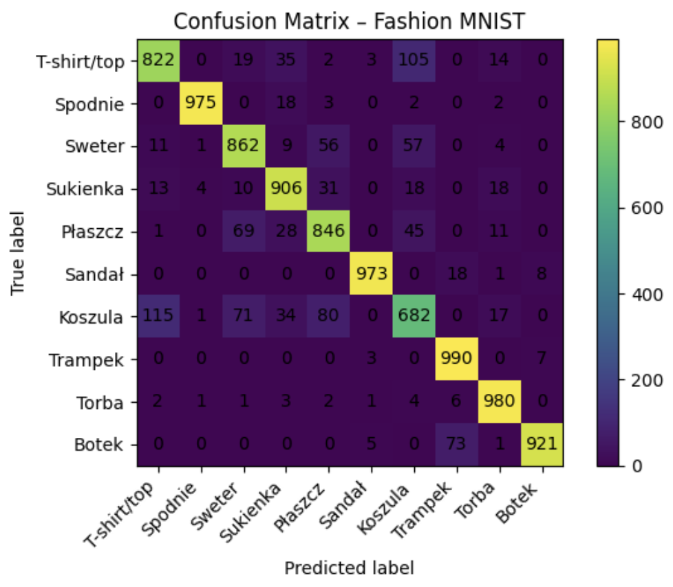

# 1. Metodologia
Przy pomocy keras tunera przygotowałem dwa typy sieci do wyboru
- Dense (w pełni połączona): Oparta na spłaszczeniu obrazu i warstwach w pełni połączonych.
- CNN (splotowa): Oparta na warstwach Conv2D i MaxPooling2D (zazwyczaj skuteczniejsza dla obrazów).

# 2. Augumentacja
W procesie uczenia zastosowałem wartswę preprocessing implementując tym samym Augumentację Danych.

Zostały uzyte trzy transformacje losowe:
- RandomFlip("horizontal"): Losowe odbicie lustrzane w poziomie (symuluje np. buty skierowane w lewo/prawo).
- RandomRotation(0.1): Delikatny obrót o +/- 10% (symuluje zdjęcie zrobione pod krzywym kątem).
- RandomZoom(0.1): Losowe przybliżenie/oddalenie.

Głównym celem takiej augumentacji było zapobieganie overfittingowi i zmuszenie sieci do nauki cech strukturalnych zamiast zapamiętywania konkretnych układów pixeli

# 3. Wyniki modelu

Ostateczny model osiągnął na zbiorze testowym następujące wyniki:

- Final Test Loss: 0.2880
- Final Test Accuracy: 89.57%

# 4. Analiza macierzy pomyłek

Powyej znajduje się macierz pomyłek wygenerowana przez model

Wnioski z analizy błędów:

### Najlepiej rozpoznawane:
- Trampek (7): 990/1000 trafień.
- Torba (8): 980/1000 trafień.
- Spodnie (1): 975/1000 trafień.
- Obiekty te mają bardzo charakterystyczny kształt, który nie zlewa się z innymi klasami.

### Największe problemy:
- Koszula (6): Tylko 682 poprawne trafienia. Model bardzo często myli ją z T-shirtem (115 pomyłek) oraz Płaszczem (80 pomyłek). Jest to klasyczny problem Fashion MNIST - przy rozdzielczości 28x28 te ubrania wyglądają niemal identycznie (rękawy, korpus).
- Botek (9): Często mylony z Trampkiem (73 pomyłki), co jest zrozumiałe, gdyż oba są obuwiem o podobnym profilu bocznym.

# 5. Wyniki augumentacji

Dzięki augumentacji mozemy zauwazyc ze:
- poprzez flipowanie horyzontalne obrazu, model nie ma problemu z rozpoznywaniem obuwia
- zmiany rotation oraz zoom mogły negatywnie wpłynąć na rozpoznywanie koszul/tshirtów ze względu na zatarcie róznic w tych ubraniach