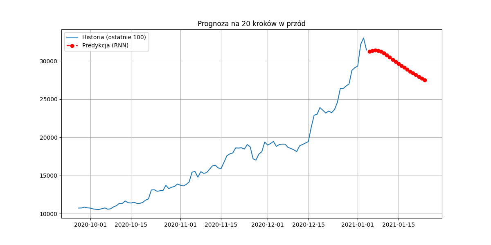
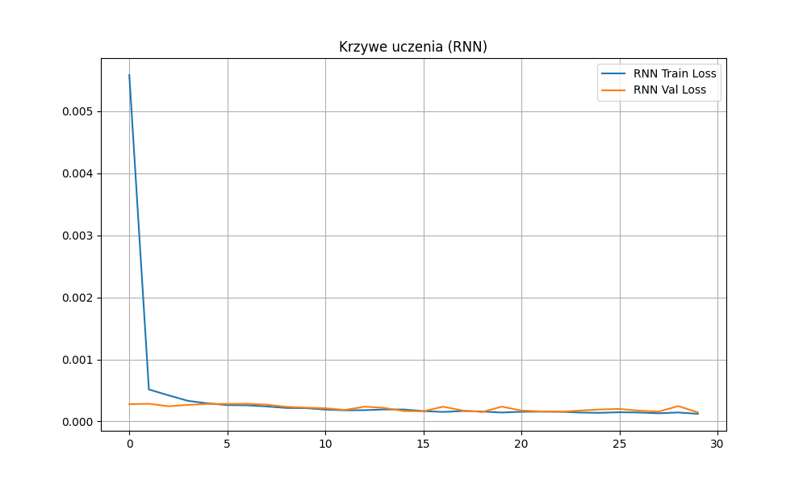

# Raport z eksperymentu predict

## 1. Porównanie modeli (Test Set)
- **RNN (Zoptymalizowany)**: MAE = 0.0122, Loss (MSE) = 0.0003
- **Dense (Baseline)**: MAE = 0.1338, Loss (MSE) = 0.0283

## 2. Najlepsze hiperparametry RNN
```json
{'rnn_type': 'LSTM', 'units': 96, 'dropout': 0.1, 'lr': 0.0033851182385612262}
```

## 3. Wizualizacja


